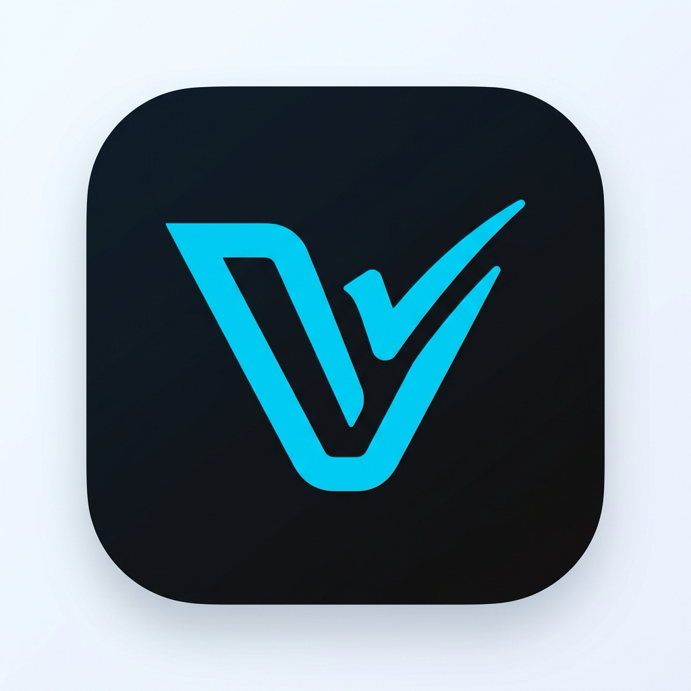

# Guanaco — Mobile Client for Vikunja

<p align="center">
  
</p>

<p align="center">
  <strong>Fast, private, and intuitive mobile task management for your Vikunja server.</strong>
</p>

<p align="center">
  <a href="#-features">Features</a> •
  <a href="#-privacy--zero-telemetry">Privacy</a> •
  <a href="#-architecture">Architecture</a> •
  <a href="#-development--testing">Development</a> •
  <a href="PRIVACY_POLICY.md">Privacy Policy</a> •
  <a href="LICENSE">License</a>
</p>

---

## 🎯 Key Features

1. **0ms Optimistic UI & Offline-First Sync**:
   - Ticking off tasks, creating tasks, and moving items happen instantly with 0ms UI latency.
   - Robust persistent mutation queue automatically retries and syncs changes with your Vikunja server.
   - Smart active-window polling preserves battery and bandwidth.

2. **Rapid Chained Task Entry (`QuickAddBar`)**:
   - Persistent bottom input bar designed for rapid consecutive capture.
   - Natural language shortcut syntax:
     - `#tag` for label tagging
     - `!urgent`, `!high`, `!medium`, `!low` for priority
     - `@date` (`@today`, `@tomorrow`, etc.) for deadlines
     - `@user` for assignment
   - Real-time autocomplete suggestions and 1-tap priority cycling.

3. **Tactile Gestures & Haptics (`SwipeableTaskItem`)**:
   - **Swipe Right**: Instant completion toggle with haptic feedback.
   - **Swipe Left**: Quick actions for moving between projects or deletion.

4. **Multi-Project Navigation & Smart Views**:
   - Drawer with live task count badges.
   - Consolidated **All Tasks** and **My Open Tasks** views.
   - Custom project colors and 1-tap task list relocation.

5. **Deep Task Details & Organization**:
   - Subtasks, percentage progress tracking, assignees, dates, reminders, and Markdown notes.

---

## 🔒 Privacy & Zero Telemetry

Guanaco is built strictly for personal privacy and data sovereignty:
- **Direct Connection:** All traffic travels exclusively between your device and your self-hosted Vikunja instance.
- **Zero Third-Party SDKs:** No Google Analytics, no Firebase, no Sentry, no crashlytics, and no ad trackers.
- **Hardware-Backed Encryption:** Server credentials and API tokens are encrypted on-device via `expo-secure-store` / Android Keystore.
- **Biometric App Lock:** Optional fingerprint and Face ID protection powered entirely by native Android hardware.

See our full [Privacy Policy](PRIVACY_POLICY.md).

---

## 🛠️ Architecture & Tech Stack

- **Framework**: React Native & Expo (TypeScript)
- **State & Sync Queue**: Zustand + `@react-native-async-storage/async-storage`
- **Secure Storage**: `expo-secure-store` (Android Keystore)
- **Gestures & Animations**: `react-native-gesture-handler` + `react-native-reanimated` + `expo-haptics`
- **Icons**: `lucide-react-native`
- **Compiler & Dex Optimization**: Android R8 full-mode code shrinking with deobfuscation mapping pipeline
- **Testing**: Jest + `@testing-library/react-native` (Full TDD suite with 288 passing tests)

---

## 🧪 Development & Testing

```bash
# Install dependencies
npm install

# Run full test suite (288 tests across 27 suites)
npm test

# Run tests with code coverage
npm run test:coverage

# TypeScript type check
npm run typecheck

# Start local dev server
npm start

# Run web preview
npm run web
```

---

## 📦 Building & Publishing

```bash
# Build production Android App Bundle (.aab) with R8 optimization locally
npm run build:bundle

# Publish bundle to Google Play Console via developer API
npm run publish:play
```

---

## 📄 License

Guanaco is open source software licensed under the [GNU General Public License v3.0 (GPL-3.0-or-later)](LICENSE).
Vikunja is an open-source project created by Kolaente.
